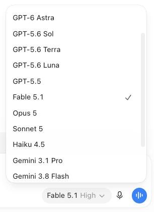
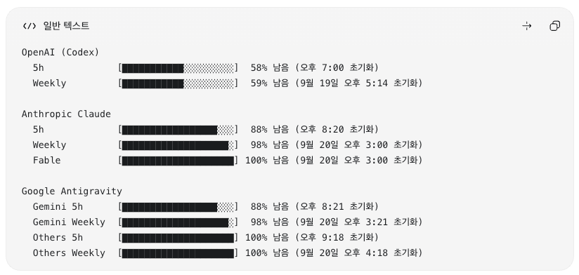

# ocx-extensions

OpenCodex discovers the models; ocx-extensions keeps the routed part of the Codex picker
short and current, and shows your quota.

It is a thin layer on top of [OpenCodex](https://github.com/lidge-jun/opencodex)
that does three things on any machine:

1. For Anthropic and Google Antigravity, shows only the **two newest generations of each
   model family**, newest first (`Opus 5.5`, `Opus 5`), under short, readable names
   (`anthropic/claude-opus-5-5` → `Opus 5.5`).
2. Keeps the picker in a stable provider/family order, while you hide anything you don't
   want with OpenCodex's own model toggle.
3. Installs the `$ocx-quota` skill, which prints live OpenAI / Anthropic / Google
   Antigravity quota gauges.

<table>
  <tr>
    <th>Model picker</th>
    <th>Quota gauges</th>
  </tr>
  <tr>
    <td></td>
    <td></td>
  </tr>
</table>

## Who owns what

| Concern | Owner | Where it lives |
| --- | --- | --- |
| Which models exist | OpenCodex live discovery | provider `/models` calls |
| Which models you hid | You, through OpenCodex | `disabledModels` in `~/.opencodex/config.json` |
| Native model order, default and subagent models | OpenCodex / Codex | untouched by this repo |
| The proxy staying up | OpenCodex | `ocx service` (Windows task `opencodex-proxy`) |
| Default picker set of the `policy.json` providers | this repo | generated `providers.<name>.selectedModels` |
| Names of those models, routed picker order | this repo | generated `modelDisplayNames` / `modelPickerOrder` |
| Periodic reconcile | this repo | one OS scheduler entry installed by `apply.sh` |
| Quota display | this repo | `skills/ocx-quota` |

This repo stores no model list. `policy.json` holds rules (family order, name
prefixes, `maxGenerationsPerFamily`), a few operator settings, and one intentional
hide exception (`ensureDisabled`); the concrete ids always come from the live catalog.
Other providers, such as `opencode-go`, are not curated: their `selectedModels`
stay exactly as you set them.

## What the picker shows

For each provider in `policy.json`, every run takes the full live catalog, groups it
into families, and keeps the newest `maxGenerationsPerFamily` (2) generations of each,
newest on top:

| Live catalog (Anthropic) | Picker |
| --- | --- |
| Opus 4.5, 4.6, 4.7, 4.8, 5, 5.5 | Opus 5.5, Opus 5 |
| Haiku 4.5, Haiku 4.5 (2025-10-01 snapshot) | Haiku 4.5 |

- A family is the id without its version, so Gemini Flash, Gemini Pro and Gemini Flash
  Image each keep their own two generations; a new Flash never pushes Pro out.
- Variants of one generation count once: a dated snapshot (`-20251001`), a
  `-preview` tag, or a capability suffix (`-thinking`, `-low/-medium/-high`). The
  picker shows one of them, preferring the plain id, then an undated tag, then the newest
  snapshot, then a capability variant (`-thinking`, then `-high`). A generation that only exists as
  `claude-opus-4-6-thinking` is shown as that id rather than dropped.
- A family the rules don't know yet (`claude-nova-6`) is still listed, after the known
  ones, and trimmed the same way.

Older generations are not deleted or disabled. They stay in OpenCodex's live inventory and
remain routable by their full slug (`anthropic/claude-opus-4-8`); they are just not part
of the generated picker list.

### Two lists, two owners

- **`selectedModels`** (for the `policy.json` providers) is generated: it is the
  automatic default picker set and is rewritten on every run. Edits to it are replaced,
  including a model added to it by `ocx models enable` or an OpenCodex preset.
- **`disabledModels`** is yours: the models you hid with OpenCodex. This repo never writes
  it during reconcile, never removes entries from it, and never uses it to drop old
  generations. A model you disabled stays hidden even while it is in the newest two.

So with `ocx models disable anthropic/claude-opus-5`, the picker shows only Opus 5.5, and
every scheduled run keeps it that way. `ocx models enable anthropic/claude-opus-5` brings
it back, with its name.

## How a new model shows up

```
provider releases claude-opus-6
→ OpenCodex catalogAutoRefresh (every 15 min) discovers it
→ the scheduled reconcile (every 15 min) adds "Opus 6" on top of the Opus group,
  drops Opus 5 from the generated selectedModels, and runs ocx sync
→ quit and reopen Codex: the picker shows Opus 6, Opus 5.5
(no repo edit)
```

OpenCodex's timer does not call this repo, so `apply.sh` registers
`scripts/reconcile-models.py` with the OS scheduler on the same 15-minute cadence
(`scripts/install-auto-reconcile.py`). The two timers are independent: OpenCodex can
take up to one refresh interval to discover a model, and ocx-extensions up to one
reconcile interval to put it in the picker, so about 30 minutes in the worst case. The
model is routable by slug as soon as it is discovered. A run with nothing to change
writes nothing; a run while the proxy is down exits without touching the config.
Scheduled runs never restart the proxy or Codex.

| OS | Entry | Remove with |
| --- | --- | --- |
| Windows | Task Scheduler task `ocx-extensions-reconcile` (runs `pythonw`, no window) | `schtasks /Delete /TN ocx-extensions-reconcile /F` |
| macOS | `~/Library/LaunchAgents/com.ocx-extensions.reconcile.plist` | `launchctl unload <plist>`, then delete the file |
| Linux | one user crontab line tagged `# ocx-extensions-reconcile` | `crontab -l \| grep -v ocx-extensions-reconcile \| crontab -` |

Re-running `apply.sh` replaces the entry with the current repo path and Python, so
there is always one. macOS and Linux runs log to `$TMPDIR/ocx-extensions-reconcile.log`.

On Windows you may also see a task named `opencodex-proxy`. That one belongs to
OpenCodex: it is the background service that keeps the proxy running (`ocx service`).
`ocx-extensions-reconcile` only refreshes the picker policy, and it needs that proxy to
be up. The reconcile task runs `pythonw.exe` and starts OpenCodex's node entry point
directly with hidden-window flags (not through the `ocx.cmd` shim and `cmd.exe`), so
a run opens no window. Windows may defer it while on battery power, depending on Task
Scheduler power settings.

To apply right away, or to troubleshoot:

```bash
python3 scripts/reconcile-models.py          # selection + names + order, then ocx sync if anything changed
python3 scripts/reconcile-models.py --check  # exit 1 if selectedModels, names or order are out of date
```

## How names are made

For each picker model, first match wins:

1. **Family rule.** Ids in a family listed in `policy.json` are shortened by rule:
   the vendor prefix is dropped, version digits are joined, and date, `-thinking`,
   and tier suffixes (`-low`, `-medium`, `-high`, `-tiered`) are removed.
   `claude-haiku-4-5-20251001` → `Haiku 4.5`, `gemini-3.9-flash` → `Gemini 3.9 Flash`.
   Non-Gemini models on Antigravity get a `Google` prefix
   (`claude-opus-5-5-high` → `Google Opus 5.5`), because they spend the
   Antigravity pool rather than your Anthropic subscription.
2. **Provider name.** An unknown family keeps the display name the provider or
   OpenCodex already supplies.
3. **Generic humanizer.** Otherwise the same shortening applies (`claude-nova-6` → `Nova 6`).
4. **Raw id.** If the id cannot be parsed safely, OpenCodex shows it as-is.

A model is never hidden because it could not be named. If two picker ids would read the
same, the stripped suffix is kept (`Google Opus 4.6 Thinking`).

For the providers listed in `policy.json`, `modelDisplayNames` is generated output
and covers exactly the generated picker set: every run recomputes it, fixes names an older
rule got wrong, and drops ids that left the picker. A model you disabled is still in the
set, so it keeps its name when you enable it. A rename made in the OpenCodex dashboard for
those providers is replaced on the next run; change the rules in `policy.json` instead.

Order within the picker: native Codex models first in Codex's own order. This repo
never adds bare native ids to `modelPickerOrder`, because one bare id would switch
OpenCodex to ordering the whole picker. Then Anthropic (Fable, Opus, Sonnet, Haiku,
other families), then Google Antigravity (Gemini Flash, Gemini Pro, Gemini Flash Image,
Google Opus, Google Sonnet, Google GPT-OSS, other families), each family newest first.
Then every other routed model, so a new model from another provider cannot land outside
the list and jump ahead: saved order is kept, a new model goes to the end of its
provider's group, and a new provider goes after the known ones.

## Hiding a model

Use OpenCodex's toggle; this repo has no hide list of its own.

```bash
ocx models disable anthropic/claude-opus-5-5
ocx models enable  anthropic/claude-opus-5-5
```

or the model switches in the OpenCodex dashboard (`ocx gui`). The choice is stored in
`disabledModels`, which the scheduled reconcile never writes, so a hidden model stays
hidden until you enable it. Enabling only undoes your own hide: a generation outside the
newest two is not part of the generated list, and `ocx models enable` adding it to
`selectedModels` lasts only until the next run. To pick from more generations, raise
`maxGenerationsPerFamily` in `policy.json`.

## Setup on a new machine

### Requirements

- OpenCodex (`ocx`) with `ocx models live --json`, provider `selectedModels` /
  `modelDisplayNames`, `modelPickerOrder`, `catalogAutoRefresh` and `ocx service`.
  Developed and verified against OpenCodex 2.76.0; no version is pinned.
- Python 3 (on Windows a regular install, which includes `pythonw.exe`).

### Agent-driven setup (recommended)

Paste this into a new Codex task:

> https://github.com/colosair/ocx-extensions
> Read the AGENTS.md in this repo and apply the setup to my current Codex environment.

### Manual setup

```bash
git clone https://github.com/colosair/ocx-extensions
cd ocx-extensions

ocx login anthropic
ocx login google-antigravity
ocx status          # if no background service is reported: ocx service

./apply.sh
```

`apply.sh` (which runs `scripts/apply.py`) stops before writing anything if a
provider login is missing or live discovery fails. Otherwise it:

- applies the settings in `policy.json` (`newModelPolicy: on`, catalog auto-refresh
  every 15 minutes, Antigravity alias and mode) and appends `ensureDisabled`;
  existing default and subagent models are left as they are;
- migrates a legacy static `selectedModels` allowlist once: models it was hiding that
  OpenCodex already knew about become `disabledModels` entries, then the list is
  replaced by the generated one. A list is treated as legacy only when
  `modelDiscovery.newModelPolicy` is not `on`, which no ocx-extensions bootstrap since
  the dynamic catalog leaves behind, so a re-run never migrates generated state;
- writes the generated `selectedModels`, names and order, runs `ocx sync`, and installs
  `skills/ocx-quota` into `$CODEX_HOME/skills`;
- registers the 15-minute reconcile with the OS scheduler (a failure here prints a
  warning and setup continues);
- checks that a second pass finds nothing to change.

It is safe to re-run. Then quit and reopen the Codex desktop app; its model list is
held in memory until it restarts.

### Windows: Codex app sandbox

Some Codex desktop sessions on Windows run commands inside the app's package context. There
OpenCodex refuses to write the Codex config, either failing with
`CodexUserIdentityRefusal: ... redirected by a junction or reparse point` or finishing a
sync with `unsafe coordinator namespace` and an unchanged catalog. `apply.sh` reports both
and stops with exit code 3. That check is a safety feature; do not work around it. Run the setup once in the normal
Windows context instead:

```
python scripts/windows-host-apply.py
```

It registers a temporary on-demand task `ocx-extensions-setup` that runs
`scripts/apply.py` with `pythonw`, waits for it, deletes the task whether apply
succeeded or not, and prints apply's output. Afterwards the only tasks are
`opencodex-proxy` (OpenCodex) and `ocx-extensions-reconcile` (this repo). In a normal
shell, just run `./apply.sh`.

## Quota gauges

`$ocx-quota` runs `ocx provider quota --refresh --json` and prints a gauge per
provider window. `5h` and `Weekly` are rolling windows, `Fable` is its own model
window, and `Others` is the shared Google Antigravity pool for non-Gemini models.
Providers that are not connected on the machine are simply absent. It works per
provider and window, so new model generations need no change there. Output is UTF-8 on
every platform, including a Korean (cp949) Windows console, with no extra Python flags.

## Tests

```bash
python3 -B -m unittest discover -s scripts
python3 -B -m unittest discover -s skills/ocx-quota/scripts
bash -n apply.sh
```

## Troubleshooting

**`Missing providers`**: log in with the printed `ocx login` command, confirm with
`ocx provider list`, and re-run.

**`reconcile skipped, config untouched: ... Proxy is not running`**: start it with
`ocx start`, or install the background service with `ocx service`, and re-run.

**`CodexUserIdentityRefusal` on Windows**: see [Windows: Codex app sandbox](#windows-codex-app-sandbox).

**Picker unchanged after apply**: the desktop app was not restarted.

**An older generation I want is missing**: it is outside the newest two. Raise
`maxGenerationsPerFamily` in `policy.json` and re-run, or route it by its full slug.

**The OpenCodex dashboard shows old names or toggles after apply**: `ocx config set`
writes the config file, and a running proxy keeps its in-memory copy until it
restarts. The Codex catalog written by `ocx sync` is already correct.
